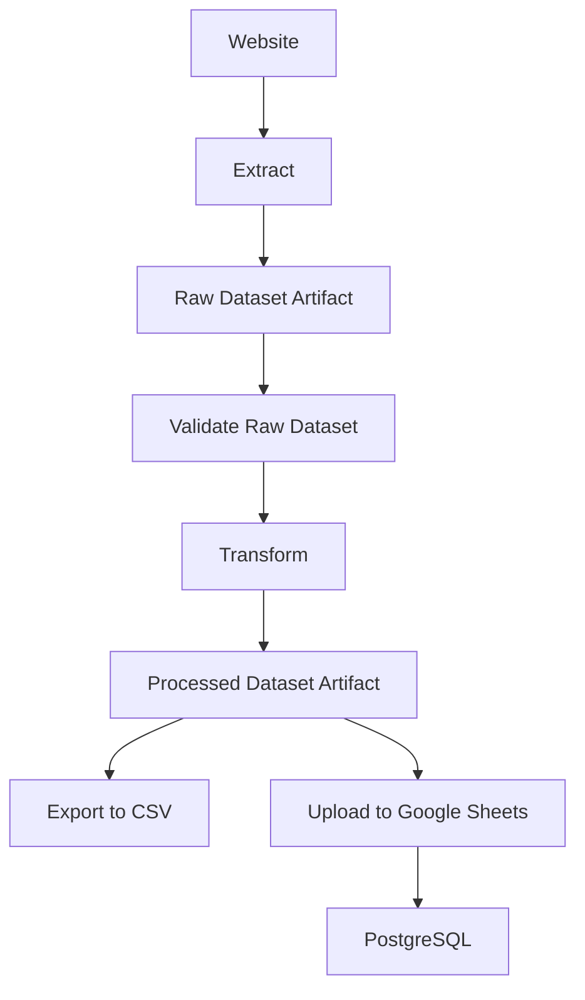
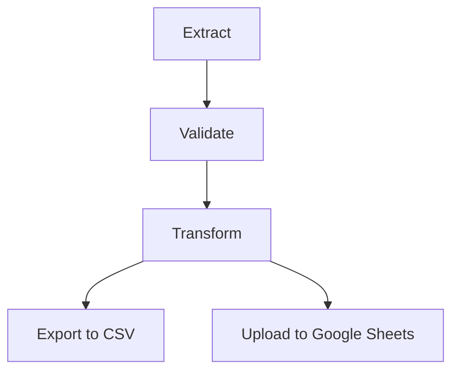

# Checklist Roadmap Orkestrasi Airflow

---

## 1. Status Saat Ini

### Fondasi Pipeline

-   [x] `extract.py`
-   [x] `transform.py`
-   [x] `load.py`
-   [x] `storage.py`
-   [ ] `validation.py` (file ada, implementasi belum selesai)
-   [x] `main.py` masih sebagai orchestrator manual (sementara)

### Storage

-   [x] DatasetArtifact
-   [x] DataLayer
-   [x] save/load raw dataset
-   [x] save/load processed dataset
-   [x] artifact_exists()
-   [x] delete_artifact()

### Testing

-   [x] Unit Test Extract
-   [x] Unit Test Transform
-   [x] Unit Test Load
-   [x] Unit Test Storage
-   [ ] Unit Test Validation
-   [ ] Integration Test

---

## 2. Refactoring Sebelum Airflow

### Struktur Project

-   [x] `utils/` → `pipeline/`
-   [x] `pipeline/load.py` sudah berada di /pipeline
-   [ ] `scripts/run_pipeline.py` (file ada, implementasi belum selesai)
-   [ ] `main.py` dipensiunkan sebagai entry point
-   [ ] `scripts/run_pipeline.py` berjalan end-to-end.
-   [ ] Seluruh pipeline menggunakan Dataset Artifact.
-   [ ] Integration test lulus.

### Pipeline Berbasis Artifact

-   [ ] Extract → `save_raw_dataset()`
-   [ ] Validate → membaca Raw Artifact
-   [ ] Transform → membaca Raw Artifact
-   [ ] Transform → `save_processed_dataset()`
-   [ ] Export CSV → membaca Processed Artifact
-   [ ] Upload Google Sheets → membaca Processed Artifact

**Alur Pipeline Berbasis Artifact:**

*Catatan: `save_raw_dataset()` dan `save_processed_dataset()` adalah fungsi `storage.py` yang dipanggil di dalam Task, bukan Task Airflow itu sendiri.*

### Validasi

-   [ ] Implementasi rule validasi
-   [ ] Validation dijalankan sebelum Transform
-   [ ] Unit test Validation

### Integration

-   [ ] Pipeline lokal end-to-end
-   [ ] Tidak ada DataFrame yang dikirim antar task

---

## 3. Airflow

### Persiapan

-   [ ] Install Airflow
-   [ ] Folder `dags/`

### DAG

**Dependensi DAG:**

### Implementasi

-   [ ] DAG Fashion Pipeline
-   [ ] Task Extract
-   [ ] Task Validate
-   [ ] Task Transform
-   [ ] Task Export CSV
-   [ ] Task Upload Google Sheets
-   [ ] Retry
-   [ ] Logging
-   [ ] Scheduling
-   [ ] Trigger Rules
-   [ ] Monitoring UI

### Verifikasi Airflow
Setelah implementasi DAG:
-   [ ] Manual Trigger
-   [ ] Retry Task
-   [ ] Failure Scenario
-   [ ] Scheduler
-   [ ] Daily Schedule

---

## 4. Pengembangan Berikutnya

### Sink

-   [ ] PostgreSQL
-   [ ] Object Storage
-   [ ] BigQuery (opsional)

### Data Engineering

-   [ ] Metadata Dataset
-   [ ] Retention Policy
-   [ ] Data Quality
-   [ ] Parameterisasi DAG
-   [ ] Environment dev/test/prod
-   [ ] CI/CD
-   [ ] Dokumentasi

---

## Prinsip Desain

-   Airflow hanya sebagai orchestrator.
-   Pipeline tetap dapat dijalankan tanpa Airflow.
-   Komunikasi antar-task menggunakan Dataset Artifact.
-   Granularity task ditentukan oleh kebutuhan orchestration, bukan jumlah fungsi.
